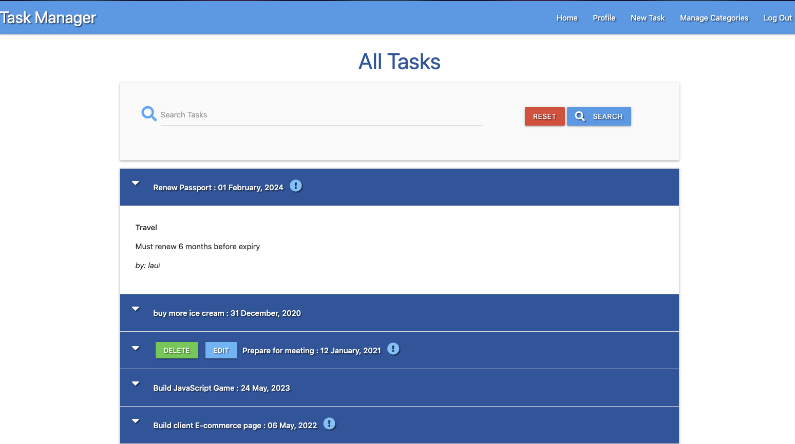

## Description

Task manager application built using Flask Jinja template language, MongoDB, and Materialize frontend framework, 
built as part of the practice from Code Institute study program.
It uses a cloud-based MongoDB provider integrated with Python.

----

## Features
The app includes: 

User authentication

Two types of user, regular and admin. Only the Admin user can create, modify and delete task categories. The manage Categories Menu is only visible for the admin

CRUD functions for each user to create, read, update and delete tasks they own.

Restricted functions per user. Only the owner of the task can edit it or delete it, but all users can see all the tasks created.

Search functionallity within the tasks created by all users

----
## Layouts
All the front end is based on Materialize framework built-in classes with very small CSS editing customisation.

----
## Required Connections 

MongoDB:

Navigate to 'mongodb.com create an account and after loggin in, start by creating a Cluster service that our database will run on.

select a Cloud provider and your closest region.

For thi project, there is no need to pay for a database, the free tier is enough, choose the M0 Tier.

Then, select 'Cluster Name' and click on the 'Create Cluster' button.

click on 'Database Access' under the Security section on the left, in order to create our database user credentials.

Click on 'Add New Database User', to create username and password.

Set user privileges to 'Read and Write to the Database', and then we can click 'Add User'.

click on 'Network Access' within the Security menu, in order to whitelist our IP address and make sure that it has access to our database.

Click 'Add IP Address', and select 'Allow Access From Anywhere.

Put the IP addresses of your hosts here, if possible, if not, choose 0.0.0.0

Go back to Clusters tab, click on the 'Collections' button, click 'Add My Own Data' to create the database.

----
## Deployment
As GitHub Pages only allows us to host static websites, can't host a Python project.

Deployment was made through Heroku host provider connected to gitHub.

Process:

On GitPod create a file env.py which will contain the secret environment variables, this file is hidden from Github.

It contains the folloing lines of code:

`import os`

`os.environ.setdefault("IP", "")`

`os.environ.setdefault("PORT", "")`

`os.environ.setdefault("SECRET_KEY", "")`

`os.environ.setdefault("MONGO_URI", "")`

`os.environ.setdefault("MONGO_DBNAME", "task_manager")`

on the "" on each line include the corresponding values for each.

IP can use default value 0.0.0.0

PORT will use the standard port used for Flask applications, which is "5000".

SECRET_KEY is required whenever using the flash() and session() functions of Flask, choose one.

It is also necessary to connect the MongoDB database in order to get the MONGO_URI value.

On Mongo website click on 'Clusters' in the left-hand menu, then from Cluster sandbox, click 'Connect'.

I didn't need to install the mongo shell, but you might need to if you're working locally on your own set.

Select 'Connect your Application', choose Python for the driver, and the appropriate version for your setup.

It's generated the command for us to use, it contains our username and cluster details already, the only thing we need to modify in the string 
is update the database name and password on the <>. Remove the angle-brackets placeholder.

mongodb+srv://username:<password>@myclustername.qgyym.mongodb.net/<dbname>?retryWrites=true&w=majority
the username and password comes from the Database Access page section on the MongoDB website.

Create Heroku account on heroku.com/

Before creating the Heroku application, setup some files that Heroku needs to run the app.

First, on Gitpod command line tell Heroku which applications and dependencies are required to run the app by creating the requirements.txt file.

This app require the following:

`click==7.1.2`

`dnspython==2.0.0`

`Flask==1.1.2`

`Flask-PyMongo==2.3.0`

`itsdangerous==1.1.0`

`pymongo==3.11.2`

`Werkzeug==1.0.1`

Next, create the Procfile that Heroku looks for to know which file runs the app, and how to run it. The file contains the following:
web: python app.py

On Heroku website once logged in, on the dashboard click on the "Create New App" button, provide a unique app name and select the region closest to you.

Once created Heroku offers 3 deployment methods:Heroku CLI, Github connect and Container.

We've chosen connect it to GitHub. which sets up Automatic Deployment from our GitHub repository. Add your repository name, then click 'Search'.

Once it finds your repo, click to connect to this app.

Before clicking to Enable Automatic Deployment, since the environment variables are contained within a hidden env.py file, Heroku 
won't be able to read those variables.

Click on the 'Settings' tab, and then click on 'Reveal Config Vars', where we can securely tell Heroku which variables are required:
(IP, PORT, SECRET_KEY and MONGO_DBNAME which is the name of our database, that is task_manager in this case)

On GitPod command line push our two new files to the GitHub repository (requirements.txt and Procfile)

Back to Heroku website on the 'Deploy' tab, click 'Enable Automatic Deployment' only has the main branch for the project, so click 'Deploy Branch'.

Heroku will now receive the code from GitHub, and start building the app using our required packages.

you'll also see "Your app was successfully deployed."

Click "View" to launch the new app.

the deployed site is now available, and will automatically update the push changes to the GitHub repository.

----
## Required packages imports

Whenever installing new packages, the requirements.txt file must be updated so that Heroku knows we require more to run the app.

The following packages have to be imported at the beggining of app.py file

* flask: Using the following: 
    flash: to show text messages after a function is executed.

    render_template: Allows Flask look inside the templates directory to find the HTML files referenced in the return of the functions.

    redirect: to use with routing will redirect to a particular function in our Flask app.

    request: when a function is called, to set conditions for the requested method GET or POST

    session: to be able to use session() functions to put the user into 'session', like a temporary page cookie.

    url_for: method to target Python functions name and to point to actual root of a file name.

* flask-pymongo : Third-party library to get Flask to communicate with MongoDB Atlas.

* dnsython: package to use the Mongo SRV connection string.

* bson.objectid: MongoDB stores its data in a JSON-like format called BSON. In order to find documents from MongoDB, we need to be able to render the ObjectId

* werkzeug.security : to make user authentication more secure using two main helpers "generate_password_hash", and "check_password_hash" that allow converting the user's password into another string, it will then salt that string with random data

* env : to grab the hidden environment variables, only if env.py file exists in our root directory.

----
## Technologies used
HTML markup language

Python programming language

MongoDB document-oriented database

Flask micro web framework

Jinja templating language

JQuery JavaScript library

Materialize front end framework

Heroku deployment

----
## Future development
add  structure like all tasks created by what user.

add a new key-value property inside the tasks, that marks an item as complete, instead of deleting it.

----
## Additional Resources 
GitPod development environment, using Code Institute student template for Gitpod.

Gitpod Reminders:
To run a frontend (HTML, CSS, Javascript only) application in Gitpod, in the terminal, type:

`python3 -m http.server`

A blue button should appear to click: *Make Public*, Another blue button should appear to click: *Open Browser*.

To run a backend Python file, type `python3 app.py`, if your Python file is named `app.py` 

In Gitpod you have superuser security privileges by default. Therefore no need to use the `sudo` (superuser do) command in the bash terminal

